# Possible - Learning App for Children with Learning Difficulties


## 📱 About The App
**Possible** is an Android application designed to help children who have difficulties in learning, such as:
- **Dyslexia** (reading difficulty)
- **Dyscalculia** (math difficulty)
- **Dysgraphia** (writing difficulty)

The app provides two paths: **Parents** and **Specialists**.

---

## ✨ Features
### 👨‍👩‍👧‍👦 For Parents
- **Drawing Letters & Numbers:**
  - Beginner Level: Tracing paths of letters and numbers.
  - Professional Level: Drawing freely, with AI model prediction for correctness.
- **Reading Practice:**
  - Speech-to-Text Recognition: Compares original text with the child's spoken words.
- **Mathematics Section:**
  - Addition, Subtraction, Arithmetic Sequences, and Comparisons.
  - Two Levels: Beginner and Professional.

### 🧑‍🏫 For Specialists
- **Remote Mentoring:**
  - Creating and sending exams to children over the internet.
  - Monitoring children's progress remotely.

---

## 🔧 Technologies Used
- **Kotlin (Android Development)**
- **Android Studio (Jellyfish - SDK 35)**
- **Retrofit (Networking)**
- **Room (Local Database)**
- **Flask Api (AI Model Prediction)**
- **Speech-to-Text Recognition (Reading Practice)**
- **Canvas (Tracing Letters and Numbers)**

---

## 📸 Screenshots
Add screenshots of your app here:

| Drawing Section | Tracing Section | Mathematics Section |
|-----------------|-----------------|---------------------|
| 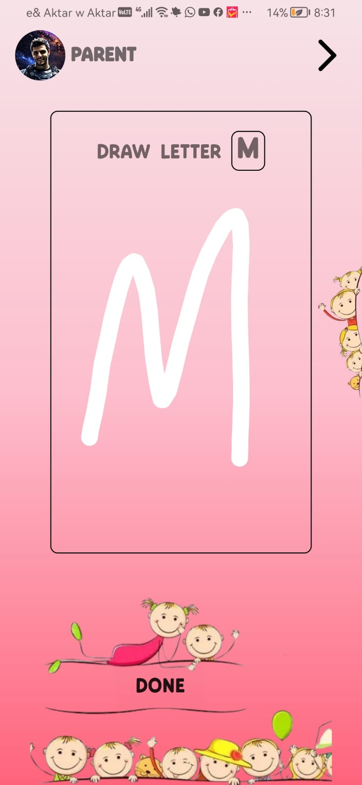 | 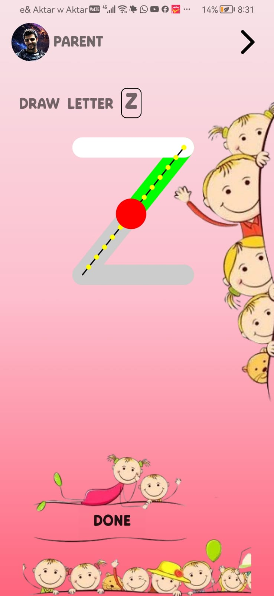 | 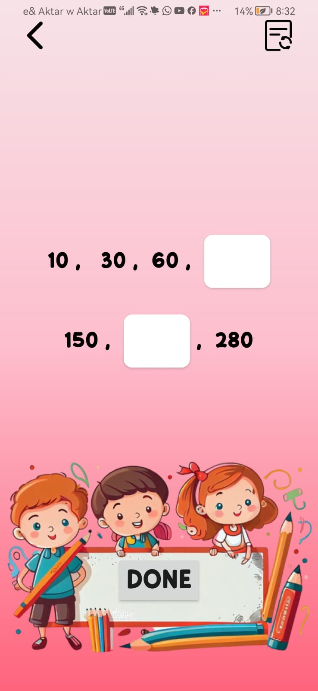 |

| Read Section | Reading Result Section | Select Sentence Section |
|-----------------|-----------------|---------------------|
| 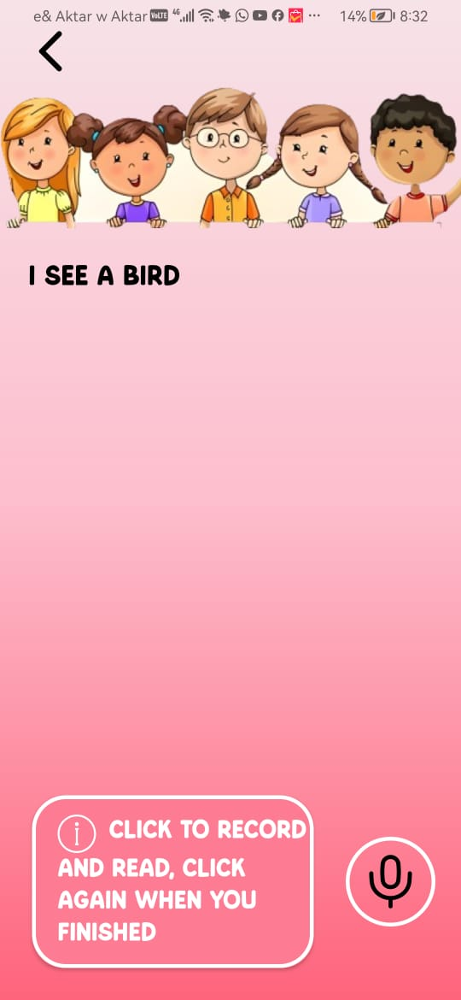 | 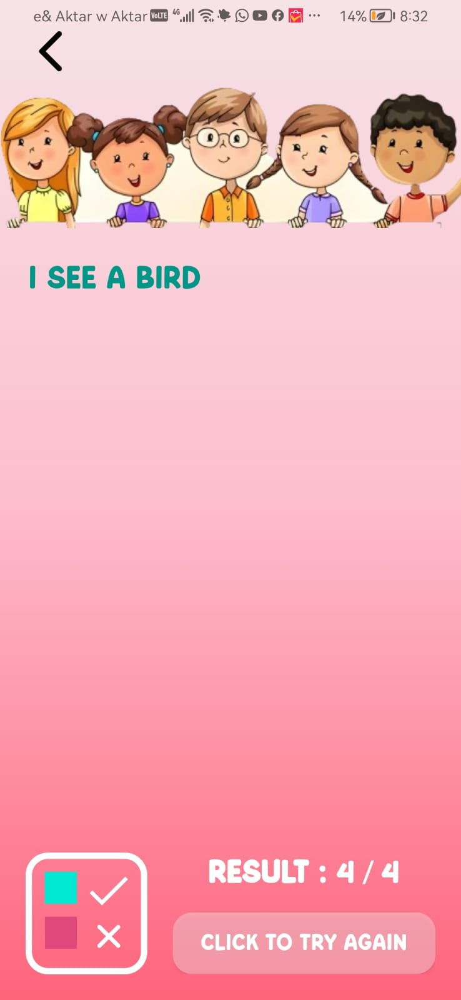 | 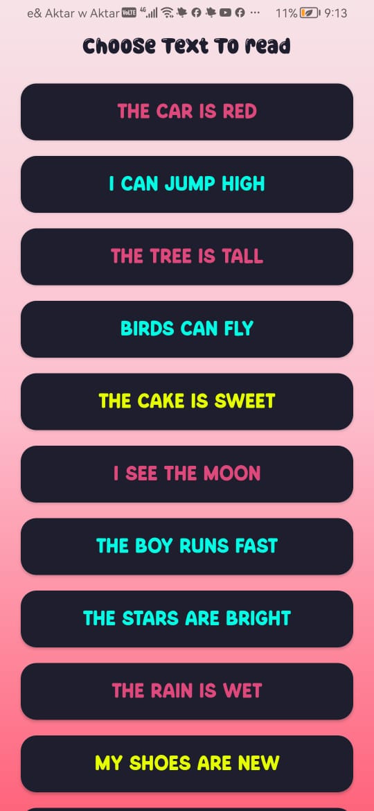 |

| Setting test | Select children| Confirm sending | Test result |
|-----------------|-----------------|---------------------|---------------------|
| 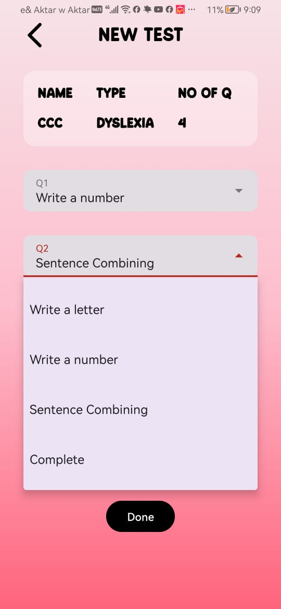 | 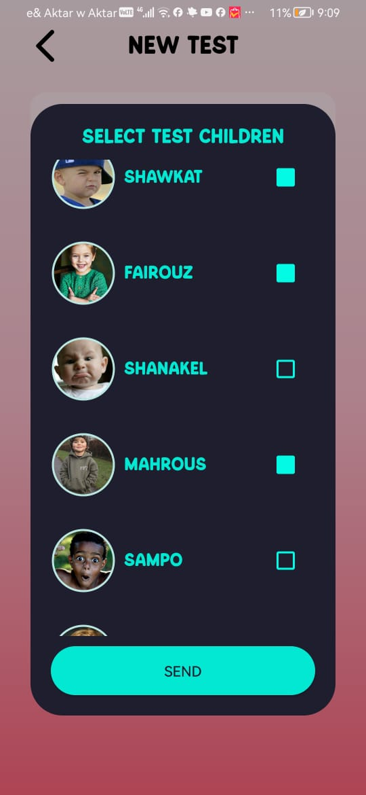 | 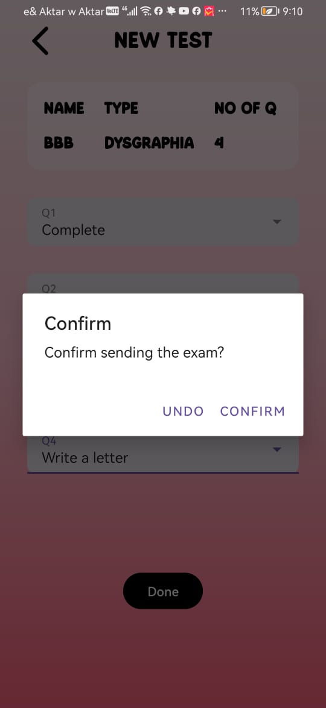 | 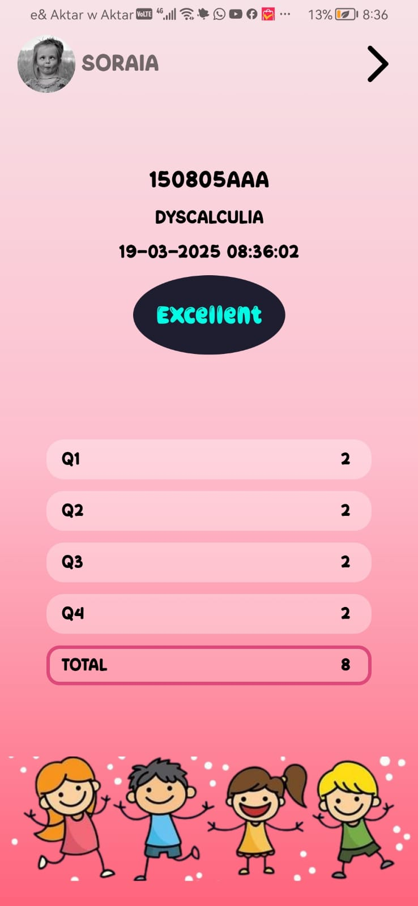


| Children Section | Tests Section | ToDo Section |
|-----------------|-----------------|---------------------|
| 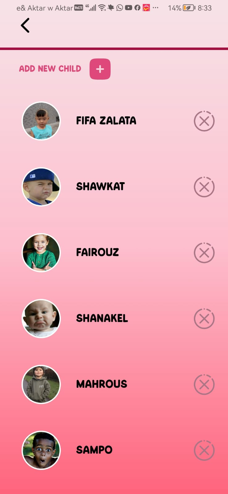 | 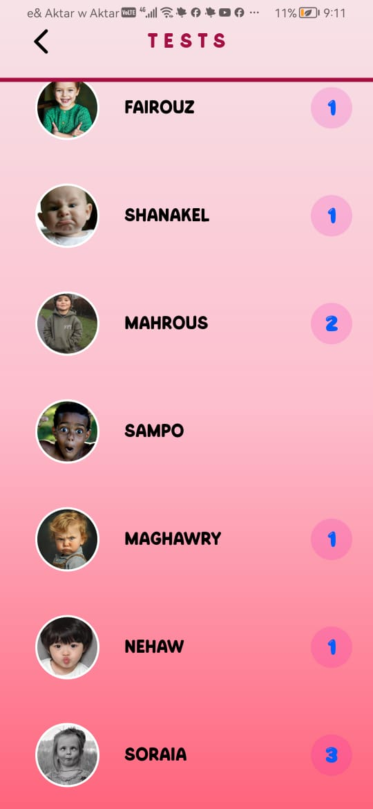 | 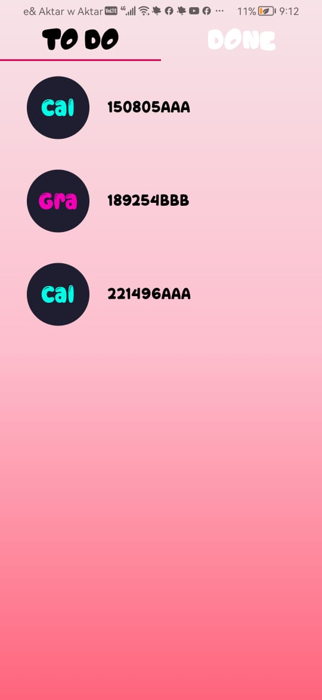 |

| Child profile | Child report Section | Solved tests | Setting |
|-----------------|-----------------|---------------------|---------------------|
| 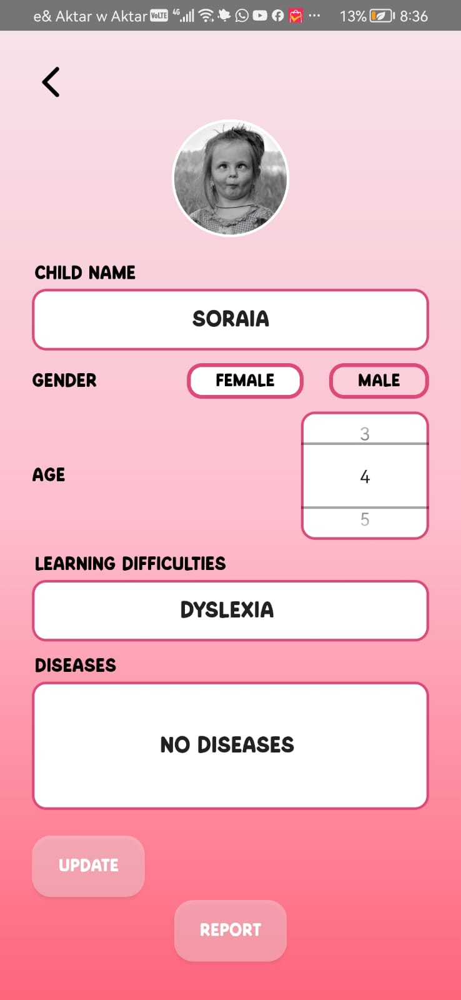 | 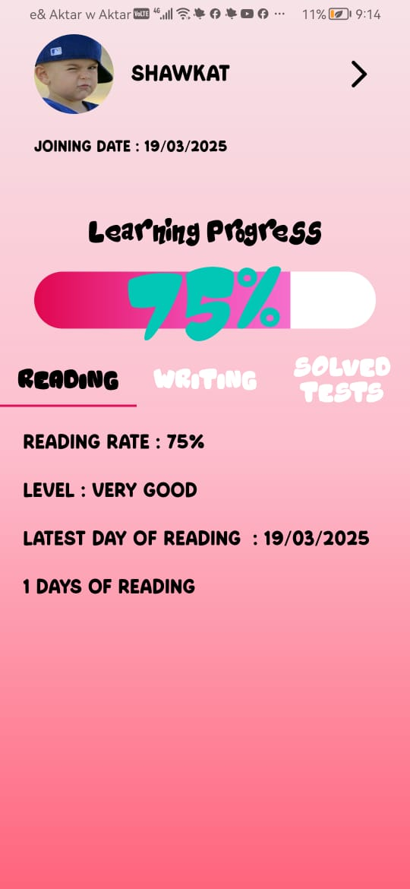 | 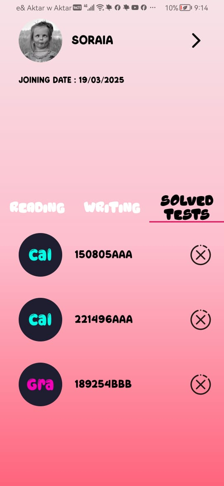 | 
|


---

## 🚀 Getting Started
### Prerequisites
- Android Studio (Jellyfish)
- Kotlin

### Installation
1. Clone the repo:
```bash
 git clone https://github.com/Gamalaldin-I/Possible.git
```
2. Open the project in Android Studio.
3. Build and run the app.

---

## 🤝 Contributing
Contributions are what make the open-source community such an amazing place to learn, inspire, and create. Any contributions you make are **greatly appreciated**.

1. Fork the Project.
2. Create your Feature Branch (`git checkout -b feature/AmazingFeature`).
3. Commit your Changes (`git commit -m 'Add some AmazingFeature'`).
4. Push to the Branch (`git push origin feature/AmazingFeature`).
5. Open a Pull Request.

---


## 📧 Contact
Gamalaldin Ibrahim - **htbtjmal2013@gmail.com**

Project Link: [https://github.com/Gamalaldin-I/Possible](https://github.com/Gamalaldin-I/Possible)
